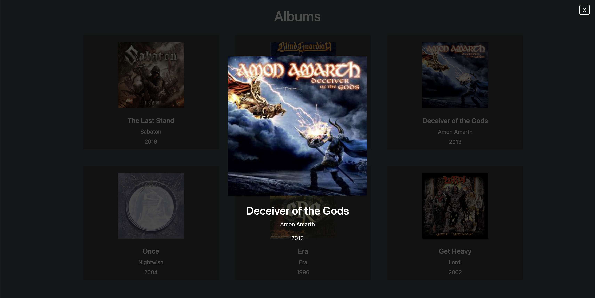

# PHP Dischi JSON

This project is a web application developed using Vue.js, PHP, and Axios. It allows users to browse a collection of albums and view information about each album in an overlay by clicking on its corresponding card. 

The data is read from a json database and decoded and later encoded with php.

A separate axios call is used to fetch the data of the clicked album for the overlay.

